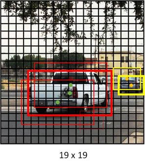

# yolo3_further

## yolo3 important configurations
<pre>
YOLO_INPUT_SIZE             = 416
YOLO_STRIDES                = [8, 16, 32]
YOLO_ANCHOR_PER_SCALE       = 3
YOLO_ANCHORS                = [[[10,  13], [16,   30], [33,   23]],
                              [[30,  61], [62,   45], [59,  119]],
                              [[116, 90], [156, 198], [373, 326]]]
YOLO_IOU_LOSS_THRESH        = 0.5
</pre>

## Grid cells

YOLO_INPUT_SIZE
> Input images are going to be rescaled into the size of (YOLO_INPUT_SIZE x YOLO_INPUT_SIZE)

YOLO_STRIDES
> YOLO_INPUT_SIZE is divided into (13 x 13), (26 x 26) and (52 x 52) grid

## Simple training (one grid has only one object at most)

### let's be simple with 3 x 3 grid cells

Two cars(Ground Truth in red) in the below image.  

Each grid will have the following label(=Y) for training.   

As a result, the output labels for each grid cell are as below:  

* Pc = 0 in the grid cells with no object detected.
* Pc = 1 in the grid cells, which have the center of Ground Truth (in Green and Yellow). 
* (bx, by, bh, bw)
   * bx: x coordinate, the center of the object corresponding to the upper left corner of the grid cell, the value range from 0~1,
   * by: y coordinate, the center of the object corresponding to the upper left corner of the grid cell, the value range from 0~1,
   * bh: height of the bounding box, the value could be greater than 1,
   * bw: width of the bounding box, the value could be greater than 1.
* c(lass labels (in the sample))
   * 1 pedestrian
   * 2 car
   * 3 motocycle

So, all grid cells output size should be 3 x 3 x 8(= 5 + 3 classes) in this example.
In case of coco dataset, its size should be 3 x 3 x 85(= 5 + 80 classes)

## Anchor Box
YOLO_ANCHORS. 
> makes it possible for the YOLO algorithm to detect multiple objects centered in one grid cell.

The center grid [1, 1] has the centers of both a woman and a car.  

So, define two anchors for each object.  

And then, the center grid has 8(=5 + 3classes) x 2 output labels as below.  

**Which anchor box takes in charge of a woman?**
> Anchor box 1 should be assigned to a woman in terms of shape (= long height)
> The similar shape is mesured by IoU below

## Intersection over Union
YOLO_IOU_LOSS_THRESH  
> Used in two processes:
>    * Train      : assigning anchor box
>    * Prediction : non maxima suppression

  

    union_area = box1_area + box2_area - intersection_area
    
<pre>
def iou(box1, box2):
    """Implement the intersection over union (IoU) between box1 and box2
    
    Arguments:
    box1 -- first box, list object with coordinates (x1, y1, x2, y2)
    box2 -- second box, list object with coordinates (x1, y1, x2, y2)
    """

    # Calculate the (y1, x1, y2, x2) coordinates of the intersection of box1 and box2. Calculate its Area.
    xi1 = max(box1[0], box2[0])
    yi1 = max(box1[1], box2[1])
    xi2 = min(box1[2], box2[2])
    yi2 = min(box1[3], box2[3])
    inter_area = (xi2 - xi1) * (yi2 - yi1)

    # Calculate the Union area by using Formula: Union(A,B) = A + B - Inter(A,B)
    box1_area = (box1[2] - box1[0]) * (box1[3] - box1[1])
    box2_area = (box2[2] - box2[0]) * (box2[3] - box2[1])
    union_area = box1_area + box2_area - inter_area
    
    # compute the IoU
    iou = inter_area / union_area
    
    return iou
</pre>

## Non-Maxima Suppression 

Prediction outputs lot of candidate bounding boxes around a object.
However, we only need one.

A truck and a car have each three bounding boxes and the thick boxes have the highest Pc value.  

Our goal is to remove those "shadow" boxes surrounding the main predicted box.
That is what non-max suppression does in 3 steps:
1. Discard all boxes with Pc less or equal to 0.6 (= USER DEFINED )
2. Pick the box with the hightest Pc output as a prediction.
3. Discard any remaining box with IoU greater than or equal to YOLO_IOU_LOSS_THRESH

Final prediction

## Yolo Predict

